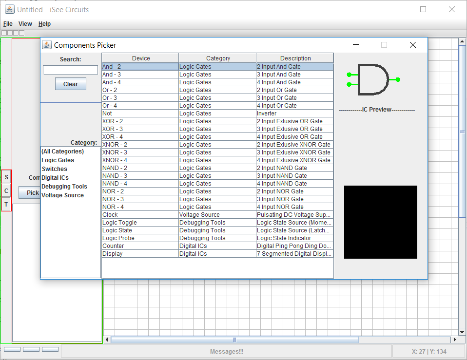
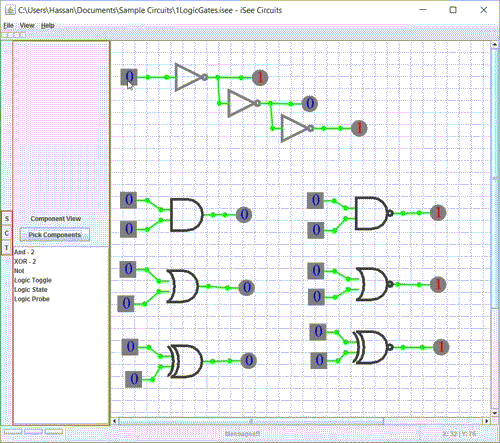

#### About
Digital Logic Circuit Simulator written in Java using swing toolkit, as a course project for Advanced Programming CS:300 Spring 2012-13, a course I look in my 2nd year of B.S. at LUMS.

#### Screenshots

Component Picker:
 

#### Gifs

#### Youtube
